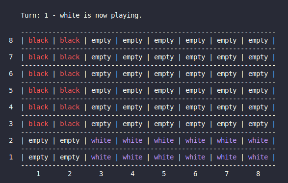
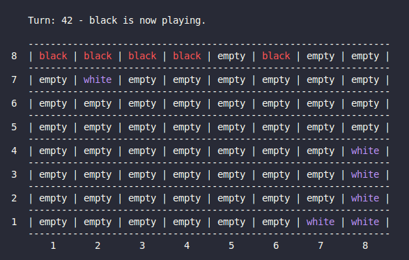
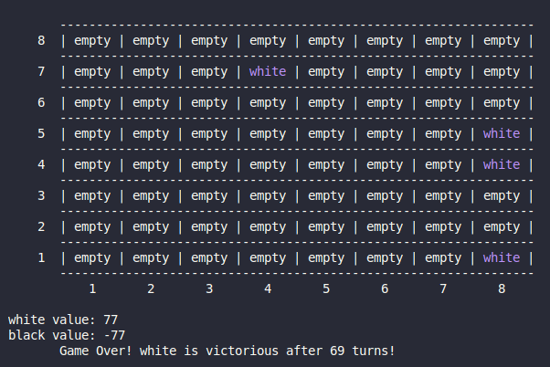

# **PFL \- TP2 - Group T11\_StormClouds\_1**

**Afonso Castro** @up202208026        
**Pedro Santos** @up202205900

# **Introduction**

This project developed by Afonso Castro (up202208026) and Pedro Santos (up202205900) consists of the creation of a board game called Storm Clouds using the Prolog language. Both group members worked equally in all the required tasks together, meaning their participation in the project is 50% each. 

# **Installation and Execution**

In order to be able to play this game, the installation of **SICStus Prolog 4.9** is necessary, so it's recommended that you follow the following instructions, and also check out the official website [https://sicstus.sics.se/](https://sicstus.sics.se/) for any doubts.  
Use the following license keys for installation:

* Site Name: student.fe.up.pt  
* License Code for Linux: *4fa3-asxr-nobo-c5bd-t6k2* and for Windows: *a5dg-asxr-nobo-b33p-ue2q*

## **SICSTUS Prolog Installation**

### Linux

1. Download the package from [https://sicstus.sics.se/download4.html](https://sicstus.sics.se/download4.html).  
2. Extract the file: *tar \-xvzf sicstus-X.Y.Z.tar.gz*  
3. Run the installation script: *./InstallSICStus*  
4. Activate the license:

   *splm \-i student.fe.up.pt*

   *splm \-a sicstus4.9\_linux permanent 4fa3-asxr-nobo-c5bd-t6k2*

### Windows

1. Install wine: *sudo apt install wine*  
2. Configure Wine:

   *export WINEPREFIX="$HOME/.local/sicstus-prolog"*

   *winecfg*

3. Download the Windows installer and install with: 

   *wine InstallSICStus-4.9.0-x64-VC15.exe*

4. Start SICStus using: 

   	*export WINEPREFIX="$HOME/.local/sicstus-prolog"*

   *wine "C:\\Program Files\\SICStus Prolog VC15 4.9.0\\bin\\spwin.exe"*

## **Storm Clouds Installation**

### Linux

1. Extract the game files: *unzip PFL\_TP2\_T11\_StormClouds\_1.zip*  
2. Move to the source directory: *cd PFL\_TP2\_T11\_StormClouds\_1/src*  
3. Start SICStus Prolog: *sicstus*  
4. Load the game module: *\[game\].*  
5. Begin the game: *play.*

### Windows

1. Extract the game archive to a folder (PFL\_TP2\_T11\_StormClouds\_1).  
2. Open Prolog and load the game.pl file from the src folder.  
3. Begin the game: *play.*

# **Description of the game**

Storm Clouds is a strategy game that combines elements of chess and checkers with asymmetric movement and capture mechanics.  
Designed by Corey L. Clark in September 2024, the game is played on a classic 8x8 checkerboard and its main goal is to eliminate all opponent pieces. Unlike traditional games that have symmetric movement or potential endings with draws, Storm Clouds ensures a definitive outcome, where one of the players always wins.  
	The game setup is composed by:

* **Board**: A standard 8x8 checkerboard is used.  
* **Pieces**: Each player has 12 pieces.  
  * **Black**: Pieces are arranged in 2 columns of 6 starting in the northwest corner.  
  * **White**: Pieces are arranged in 2 rows of 6 starting in the southeast corner.

Storm Clouds is a turn-based game where two players, Black and White, alternate turns. On their turn, a player may move one piece according to the movement rules of their color. Black pieces can move to adjacent squares in the north, northeast, east, or southeast directions without capturing. While White pieces can move, also without capturing, to adjacent squares in the east, northeast, north, or northwest directions.  
Capturing is performed differently. Both players can capture opponent pieces by moving like a chess queen but only in the directions opposite to their non-capturing moves. For Black, capturing is possible in the south, southwest, west, and northwest directions. For White, capturing is allowed in the south, southeast, west, and southwest directions.  
The goal of the game is to eliminate all the opponent's pieces, and if a player has no legal moves on their turn, they must pass, being this the only allowed moment to do so, as passing is otherwise prohibited.  
All information regarding this game was obtained from the website given to us in the project description  ([https://boardgamegeek.com/boardgame/429340/storm-clouds](https://boardgamegeek.com/boardgame/429340/storm-clouds)).

# **Game Logic**

## **Game Configuration Representation**

The game configuration is a key element of the game setup, as it determines whether the player is human or controlled by the computer (PC), as well as the difficulty level of these PC-controlled players.  
The configuration is represented as a Prolog term **game\_config/2**, where the two arguments specify the configuration for each player:

* **player1(type)** – Describes the type of player 1 (white) (either human or pc(Level) where the Level specifies the difficulty level of the computer controlled player).  
* **player2(type)** – Describes the type of player 2 (black) in the same format.

For example **game\_config(player1(human), player2(human))** represents a game where both players are human, **game\_config(player1(human), player2(pc(1)))** represents a game where Player 1 is human, and Player 2 is controlled by the computer at difficulty level 1 and **game\_config(player1(pc(2)), player2(pc(1)))** represents a game where both players are controlled by the computer at different difficulty levels.

The **setup\_game\_config/2** predicates determine the game configuration based on the user's choice in the game menu. The configuration is set based on the selected option (1, 2, 3, or 4):

* 1 \- Both players are human.  
* 2 \- Player 1 is human, and Player 2 is controlled by the computer.  
* 3 \- Player 1 is controlled by the computer, and Player 2 is human.  
* 4 \- Both players are controlled by the computer.

Once the configuration is set, the **initial\_state/2** predicate uses the configuration to initialize the game state. It uses the **create\_initial\_board/1** predicate to set up the game board with the starting positions for both Black and White pieces. The initial state includes the starting configuration of the board and the starting player’s color (which is always white). 

## **Internal Game State Representation**

The game state in Storm Clouds is represented by a prolog term state(Board, CurrentPlayer), where:

* **Board**: A list of lists that represents the 8x8 grid of the board, with each cell containing a piece (if occupied) literally represented by *'white'* or *'black'*, or *'empty'* if no piece is located there.  
* **CurrentPlayer**: An atom representing the player whose turn it is. It can be either *‘white’* or *‘black’*.

Knowing that **display\_game(state(Board, CurrentPlayer))** displays the current game state on the terminal at each turn, the following images are example representations of the game state during a game session.

### **Initial Game State**

At the start of the game, each player's pieces are placed in their respective rows and columns, as described earlier. The CurrentPlayer is set to white as it is the first to play.

    
        <figcaption style="font-size: smaller"> Figure 1: Initial game state </figcaption>
    </img>

### **Intermediate Game State**

In this intermediate state, one of the white pieces has moved from position (8,7) to (2,7), successfully capturing a black piece that was standing on this position. The current player is now black, as indicated above the board.

    
        <figcaption style="font-size: smaller"> Figure 2: Intermidiate game state </figcaption>
    </img>

### **Final Game State**

At the end of the game, one player has eliminated all of the opponent's pieces. An example of a final state might look like this if white has captured all of black's pieces and won the game.

    
        <figcaption style="font-size: smaller"> Figure 3: Final game state </figcaption>
    </img>

## **Move Representation**

In this game, a move consists of the position of the piece being moved, the direction of movement, and the target destination where the piece is moved to.  
Each move is then represented by the move term in the form: **move(Row, Col, Direction, NewRow, NewCol)**.  
The **move/3** predicate checks if the move is valid, executes the move, updates the board, and switches the player. It uses **valid\_moves/2** to check for legal moves, **execute\_move/4** to update the board, and **switch\_player/2** to change turns. The move is executed by replacing the piece at the old position with empty and placing the piece at the new position on the board using **replace/4**.

## **User Interaction**

The game menu prompts the user to select a game type. The input is read and validated with **validate\_choice/2** to ensure the number received is associated with a valid game configuration. The **read\_move** function prompts the user to input the piece's coordinates and direction during the game on its turn, ensuring valid input for both by reading and validating each value. If invalid, the user is asked to introduce these values again.

# **Conclusions**

This group project allowed us to create the game Storm Clouds with basic gameplay mechanics, board setup, and turn based progression.  
The game runs successfully to the point it handles player input, its move validation, and switches players' turns, allowing for a fun experience despite its simplicity.  
However, there are limitations as prolog’s way of functioning, based on backtracking and pattern matching, can lead to performance issues and become less efficient when the game logic becomes more complex or when large state spaces need to be explored.  
	We believe our input system could be improved even more, allowing to make the gameplay experience smoother, although the fact that prolog relies heavily on text-based input and output can limit our work.

# **Bibliography**

* Storm Clouds on boardgamegeek.com \- [https://boardgamegeek.com/boardgame/429340/storm-clouds](https://boardgamegeek.com/boardgame/429340/storm-clouds)  
* ChatGPT \- [https://chatgpt.com/](https://chatgpt.com/)  
  * We used this tool in the development of our game, in order to help us in some topics such as SICStus prolog errors interpretation, in-game move representation, pc's decision making algorithm creation and move validation.

# 

